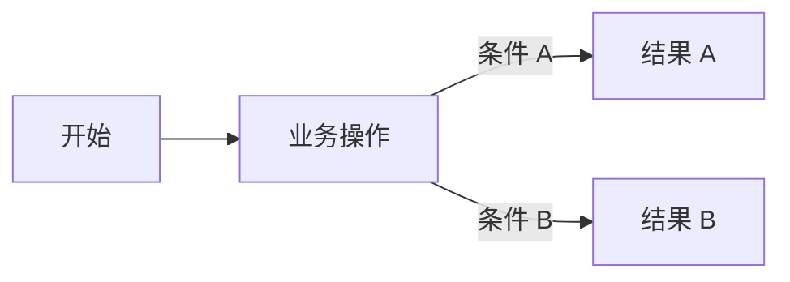
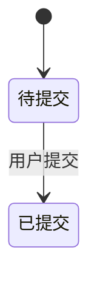

# PRD 简洁模板

原则：先让人愿意看，再让技术能执行。正文只写与本次需求直接相关的内容；不适用的章节删除；未确认但会影响方案的内容放到“待确认问题”，不要自行补全。

适用但不要堆砌：

- 业务用户要先看懂：场景、流程、页面、字段、状态、例子。
- 技术同事要能执行：规则、边界、异常、权限、数据来源、触发点、验收标准。
- 复杂逻辑优先用图表：流程图、状态机、判定表、字段表。
- 重要改动使用红色加粗：`<strong>重要改动内容</strong>`。
- 涉及现有系统但现有逻辑未确认时，必须先追问确认，不能写“沿用原逻辑”。

## 0. 一页摘要

这一页让评审人先判断“要不要继续往下看”和“重点在哪里”。

| 项目 | 内容 |
|---|---|
| 需求名称 | |
| 一句话目标 | |
| 业务用户 / 使用角色 | |
| 本次范围 | |
| 不做范围 | |
| 核心改动 | 引用 `CH-xx`，只列最重要的 3-5 条 |
| 影响系统 / 页面 / 流程 | |
| 关键图示 | 流程图 / 状态机 / 页面截图 / 原型链接 |
| 阻塞问题 | 没有写“无”；有则引用 `Q-xx` |

## 1. 背景、场景与目标

### 1.1 背景

- 当前发生了什么？
- 谁遇到了问题？
- 为什么现在要改？

### 1.2 业务场景

| 场景编号 | 用户 / 角色 | 触发情境 | 用户要做什么 | 期望结果 | 要避免的问题 |
|---|---|---|---|---|---|
| SC-01 | | | | | |

可以补一句业务故事：

> 一位【用户/角色】，在【业务情境】下，需要【完成动作】，以获得【业务结果】。

### 1.3 目标与非目标

| 目标 | 衡量方式 |
|---|---|
| | |

| 本次做 | 本次不做 |
|---|---|
| | |

## 2. 现状与改动说明

只要是在现有系统、现有页面、现有流程或现有规则上修改，本章节必填。

### 2.1 现有入口与依据

| 系统 / 模块 | 页面 / 菜单 / 入口 | 现有依据 | 已确认内容 | 未确认内容 |
|---|---|---|---|---|
| | | 截图 / 现有 PRD / 系统查看 / 代码 / 接口文档 | | |

### 2.2 现有逻辑与新逻辑对比

| 改动编号 | 改动位置 | 现有逻辑 | 新逻辑 | 影响范围 |
|---|---|---|---|---|
| CH-01 | | | <strong></strong> | 页面 / 状态 / 字段 / 权限 / 数据 / 接口 / 测试 |

规则：

- 现有逻辑不清楚时，先列入 `Q-xx`，不要猜。
- 不能写“其他不变”“同原逻辑”，除非说明不变范围和依据。
- 真正没有旧功能时，才写“无现有功能”。

## 3. 业务流程

有跨角色、跨系统、分支判断或 3 步以上连续动作时，必须放流程图。

> 图说：说明起点、关键判断、角色/系统交接、正常结果和异常兜底。

| 节点编号 | 操作人 / 系统 | 触发点 | 前置条件 | 处理逻辑 | 结果 / 下一步 | 异常处理 |
|---|---|---|---|---|---|---|
| FLOW-01 | | | | | | |

## 4. 状态流转

对象存在生命周期时使用，例如订单、审批、合同、任务、账单、导出任务。

| 流转编号 | 原状态 | 触发人 / 触发点 | 流转条件 | 新状态 | 副作用 | 失败 / 并发处理 |
|---|---|---|---|---|---|---|
| ST-01 | | | | | 通知 / 待办 / 额度 / 账务 / 留痕 / 下游消息 | |

## 5. 页面与交互

每个页面只写用户能看到、能操作、会影响规则和验收的内容。截图、原型图或 UI 图放链接，并说明要看哪里。

### PAGE-XXX：页面名称

- 页面入口：
- 适用角色：
- 页面用途：
- 关联截图 / 原型 / UI：
- 加载、空态、异常、无权限状态：

### 5.1 管理后台 / 内部管理系统页面

管理后台、运营后台、内部管理系统建议按以下顺序写。字段很多时用表，字段很少时用列表即可。

#### 列表页字段

1）字段 A：取值来源、展示格式、空值处理、点击行为。

2）字段 B：不同状态、角色或数据条件下如何展示。

| 字段 | 取值来源 | 展示规则 | 空值 / 异常 | 权限 / 脱敏 | 点击 / 跳转 |
|---|---|---|---|---|---|
| | | | | | |

#### 筛选项

1）筛选 A：类型、默认值、选项来源、查询逻辑。

2）日期筛选：日期口径、起止边界、是否含当天、最大范围。

| 筛选项 | 类型 | 默认值 | 选项来源 | 查询逻辑 | 清空 / 重置 |
|---|---|---|---|---|---|
| | | | | | |

#### 操作

1）新增：弹窗 / 新页面展示新增页面，说明字段校验、提交结果、失败处理。

2）导出：支持批量导出，说明导出范围、数量上限、文件格式、字段权限。

| 操作 | 可见角色 | 可用条件 | 二次确认 | 成功结果 | 失败处理 | 操作留痕 |
|---|---|---|---|---|---|---|
| | | | | | | |

#### 权限

| 角色 | 可见数据范围 | 可用操作 | 不可用时展示 |
|---|---|---|---|
| | | | |

#### 分页与其他页面元素

- 分页：默认每页数量；是否支持 `10/20/50/100`；翻页后勾选是否保留。
- 排序：默认排序字段和升降序。
- 批量选择：当前页 / 跨页 / 全选范围。
- 页面状态：加载中、空数据、查询失败、操作失败、无权限。
- 跳转返回：返回后是否保留筛选条件和页码。
- 汇总数据：统计口径是否基于当前筛选结果。

### 5.2 C 端 / 移动端页面

- 入口与触发：菜单、消息、扫码、外链、工作台等。
- 页面字段：来源、格式、空值、脱敏、校验、错误提示。
- 页面操作：可见条件、可用条件、提交处理、成功/失败结果。
- 页面状态：加载、空态、处理中、成功、失败、无权限、链接失效。
- 文案与通知：按钮、弹窗、错误提示、推送文案需要写完整。

## 6. 系统规则、数据与接口

没有页面展示、但系统会自动处理的逻辑写在这里。

| 规则编号 | 触发点 | 输入 / 来源 | 处理逻辑 | 输出 / 副作用 | 异常 / 重试 / 回滚 |
|---|---|---|---|---|---|
| RULE-01 | | | | | |

涉及接口时补充：

| 接口 / 数据对象 | 调用方 | 被调用方 | 调用时机 | 关键字段 | 成功条件 | 失败处理 |
|---|---|---|---|---|---|---|
| | | | | | | |

涉及数据归属变化时说明：

- 新数据归属对象和唯一键；
- 存量数据如何迁移或兼容；
- 查询、修改、删除和审计读取哪个对象；
- 失败、重复、缺失关联如何处理。

## 7. 异常、边界与示例

只写与本需求有关的异常，不凑全。

| 类型 | 场景 | 系统处理 | 用户看到什么 | 是否可重试 / 回滚 |
|---|---|---|---|---|
| 空数据 / 无权限 / 重复提交 / 并发 / 超时 / 外部系统失败 / 历史数据兼容 | | | | |

### 示例

#### EX-01 正常场景

- 前提：
- 输入：
- 操作：
- 系统处理：
- 结果：

#### EX-02 异常或边界场景

- 前提：
- 触发：
- 系统处理：
- 用户提示：
- 后续处理：

## 8. 验收、决策与待确认

### 8.1 验收标准

验收标准必须能判断通过或失败，覆盖主流程和关键异常。

| 验收编号 | 关联需求 | 前提 | 操作 | 预期结果 |
|---|---|---|---|---|
| AC-01 | | | | |

### 8.2 决策记录

| 决策编号 | 问题 | 最终决策 | 决策人 | 影响范围 |
|---|---|---|---|---|
| D-01 | | | | |

### 8.3 待确认问题

| 问题编号 | 问题 | 为什么影响需求 | 负责人 | 状态 |
|---|---|---|---|---|
| Q-01 | | | | 待确认 |

### 8.4 评审与同步

- 评审结论：
- 已同步材料：PRD / 原型 / UI / 接口 / 测试用例。
- 本次更新影响：
- 答疑负责人：

## 可删除章节建议

- 没有状态生命周期：删除“状态流转”。
- 没有页面：删除“页面与交互”。
- 没有接口或后台规则：删除“系统规则、数据与接口”。
- 简单纯文案或小改动：保留“摘要、现状与改动、验收、待确认”即可。
