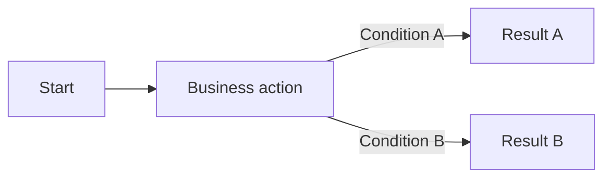
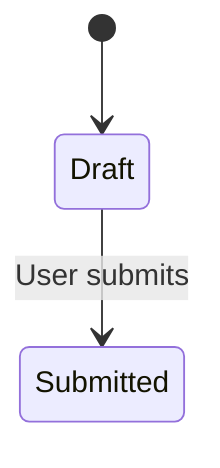

# PRD 模板

根据实际需求选择适用章节。真正无关的章节可以删除；适用但尚未确认的内容必须放入待确认问题，不得自行补全。编写复杂需求前读取 [clarity-and-alignment.md](clarity-and-alignment.md)；涉及资金、接口、三方系统或移动端时，同时读取 [scenario-patterns.md](scenario-patterns.md) 中匹配的场景模板。

## 目录

1. 文档信息；2. 需求概述；3. 业务用户与场景；4. 现状依据；5. 业务流程；6. 状态机；7. 页面与交互；8. 现有与新逻辑；9. 后台规则、数据、接口和非功能；10. 权限与留痕；11. 异常与边界；12. 示例；13. 视觉材料；14. 验收；15. 决策与问题；16. 迭代记录；17. 评审、答疑与同步。

## 1. 文档信息

| 项目 | 内容 |
|---|---|
| 产品 / 模块 | |
| PRD 标题 | |
| 版本 | |
| 负责人 | |
| 评审人 | |
| 状态 | 草稿 / 评审中 / 已确认 |
| 关联材料 | 现有 PRD、系统链接、截图、原型图、UI 设计、接口文档 |

### 1.1 链接与附件

| 材料类型 | 名称 | 链接 / 文件 | 版本或日期 | 用途 |
|---|---|---|---|---|
| 现有系统 | | | | 确认现状 |
| 原型图 | | | | 确认页面结构与交互 |
| UI 设计 | | | | 确认视觉和状态样式 |
| 接口文档 | | | | 确认字段、时机和返回规则 |
| 合同 / 附件 | | | | 确认协议或业务规则 |

### 1.2 配图清单

写正文前先确定需要的图，避免写完后遗漏。

| 图编号 | 图类型 | 说明内容 | 关联章节 | 状态 |
|---|---|---|---|---|
| FIG-01 | 流程图 / 状态机 / 时序图 / 页面截图 | | | 待补充 / 已完成 |

## 2. 需求概述

### 2.1 一页核心摘要

摘要只写结论和入口，不复制详细规则。

| 项目 | 内容 |
|---|---|
| 一句话目标 | |
| 业务用户与核心场景 | |
| 本次范围 / 非目标 | |
| 核心改动 | 最多列出最影响实现和验收的改动，并引用需求编号 |
| 影响系统、模块和角色 | |
| 关键流程图 / 状态机 | 引用 `FIG-xx` |
| 阻塞问题 | 引用 `Q-xx`；没有则写“无” |
| 验收入口 | 引用核心 `AC-xx` |

### 2.2 背景与问题

- 当前发生了什么？
- 谁遇到了问题？
- 问题发生在什么业务情境？
- 造成了什么结果或风险？

### 2.3 目标与成功标准

| 目标编号 | 业务结果 | 衡量方式 | 目标值 |
|---|---|---|---|
| G-01 | | | |

### 2.4 范围与非目标

| 本次范围 | 本次不做 |
|---|---|
| | |

### 2.5 术语表

只收录可能产生歧义、跨系统或存在历史别名的术语。

| 标准术语 | 定义 | 禁止混用或历史别名 | 对应字段 / 状态 | 依据 |
|---|---|---|---|---|
| TERM-01 | | | | |

### 2.6 功能与影响清单

| 需求编号 | 功能 / 规则 | 当前逻辑 | 新逻辑 | 影响系统、数据、接口、权限或测试 | 详细章节 / 图示 |
|---|---|---|---|---|---|
| FR-01 | | | | | |

## 3. 业务用户与业务场景

| 场景编号 | 用户 / 角色 | 时间或情境 | 操作 | 期望结果 | 要避免的风险 |
|---|---|---|---|---|---|
| SC-01 | | | | | |

主要业务故事：

> 一位**【业务用户】**，在**【业务情境】**下，需要执行**【操作】**，以获得**【结果】**并避免**【风险】**。

## 4. 现状依据

修改现有页面、流程、状态、字段、系统集成或后台规则时，本章节必填。

| 依据编号 | 来源 | 能确认的内容 | 不能确认的内容 |
|---|---|---|---|
| UI-01 | 现有页面截图 | 可见字段和按钮 | 隐藏权限、计算规则、触发条件和副作用 |

### 4.1 现有位置

| 系统 | 模块 | 菜单 / 页面 / 入口 | 用户和角色 |
|---|---|---|---|
| | | | |

### 4.2 现有逻辑

描述与本次改动直接相关的现有业务流程、状态机、页面行为、数据规则、后台规则、系统集成、通知、操作留痕和异常处理。

## 5. 业务流程

流程存在分支、跨角色交接或三个以上连续步骤时，必须增加流程图。

> 图说：说明流程起点、关键判断、系统或角色交接、正常结果和异常分支。

| 节点编号 | 操作人 / 系统 | 触发点 | 前置条件 | 操作或系统处理 | 输出 / 下一节点 | 失败处理 |
|---|---|---|---|---|---|---|
| FLOW-01 | | | | | | |

### 5.1 规则执行顺序与分支

当多个规则可能同时命中时，必须明确规则优先级、判断时机、短路条件和互斥范围。

| 顺序 | 规则编号 | 判断时机 | 命中条件 | 命中后是否继续判断 | 互斥对象 / 范围 | 输出结果 |
|---|---|---|---|---|---|---|
| 1 | RULE-01 | | | 是 / 否 | | |

存在“继续办理 / 重新办理”“恢复 / 重建”等分支时，分别说明：

1）每个分支的入口条件、提示文案和下一页面。

2）继续办理时的数据带出范围：自动带出的字段、数据来源、更新时间和允许重新编辑的范围。

3）重新办理时保留、清空或新建的数据，以及旧记录如何处理。

4）不同渠道、产品、组织或业务类型是否相互独立，禁止误命中其他范围的数据。

## 6. 状态机

| 流转编号 | 原状态 | 操作人 / 触发点 | 流转条件 | 新状态 | 副作用 | 失败 / 并发处理 |
|---|---|---|---|---|---|---|
| ST-01 | | | | | | |

副作用包括但不限于库存、额度、账务、支付、通知、待办、操作留痕和下游系统消息。

## 7. 页面与交互

### 7.1 通用页面信息

#### PAGE-XXX：页面名称

- 现有位置或新增入口：
- 适用用户和权限：
- 关联视觉材料：`UI-xx`
- 页面用途：
- 加载、空数据、异常和无权限状态：

### 7.2 管理后台或内部管理系统页面模板

管理后台、运营后台或内部管理系统的页面，必须按以下顺序编写。每一项都要写明展示或触发条件、数据来源、处理逻辑、权限、结果和异常情况；不能只列名称。

#### 列表页字段

1）`F-01` XXX：说明展示位置、取值来源、计算或映射规则、格式、空值处理、权限和点击行为。

2）`F-02` XXX：说明字段在不同状态、角色或数据条件下如何展示。

字段较多时可使用下表：

| 字段编号 | 字段名称 | 展示位置 | 取值来源 | 计算 / 映射规则 | 格式 | 空值处理 | 权限 / 脱敏 | 排序 / 筛选 | 点击行为 |
|---|---|---|---|---|---|---|---|---|---|
| F-01 | | | | | | | | | |

字段还必须说明：是否可编辑或只读、默认值、动态展示条件、不同产品或状态下的差异，以及字段归属的业务对象。字段从客户、订单、账单等一个对象迁移到另一个对象时，说明新旧数据迁移、历史查询和兼容方式。

#### 筛选项

1）XXX：说明筛选类型、默认值、选项来源、是否支持多选和清空后的行为。

2）XXXX：日期筛选；说明日期类型、开始与结束边界、是否包含当天、时区和最大可选范围。

| 筛选编号 | 筛选项 | 类型 | 默认值 | 选项 / 取值来源 | 查询逻辑 | 清空 / 重置行为 |
|---|---|---|---|---|---|---|
| FILTER-01 | | | | | | |

#### 操作

1）新增：弹窗展示新增页面；说明谁能看到、何时可点击、字段校验、提交结果和失败处理。

2）导出：支持批量导出；说明导出范围、最大数量、文件格式、字段权限、任务状态和失败处理。

| 操作编号 | 操作名称 | 可见角色 | 可用条件 | 二次确认 | 系统处理 | 成功结果 | 失败结果 |
|---|---|---|---|---|---|---|---|
| A-01 | | | | | | | |

每个重要操作补充副作用：

| 操作编号 | 状态变化 | 数据新增 / 修改 / 删除 | 下游流程或接口 | 通知 / 待办 | 操作留痕 | 失败回滚 / 补偿 |
|---|---|---|---|---|---|---|
| A-01 | | | | | | |

#### 权限

1）查看权限：说明角色、组织、区域、客户、数据归属等可见范围。

2）操作权限：分别说明新增、编辑、删除、审核、导出等按钮的可见和可用条件。

| 角色 | 查看 | 新增 | 编辑 | 提交 / 审核 | 删除 / 取消 | 导出 | 数据范围 |
|---|---|---|---|---|---|---|---|
| | | | | | | | |

#### 分页

1）支持选择每页展示数量，选项为 `10/20/50/100`；同时明确默认数量、切换每页数量后的页码处理、总数展示和翻页后的勾选保留规则。

#### 其他页面元素

1）排序：说明默认排序字段、升降序和多字段排序规则。

2）批量选择：说明跨页选择、全选范围和取消选择规则。

3）页面状态：说明加载中、空数据、查询失败、操作失败和无权限状态。

4）跳转与返回：说明打开方式、参数传递、返回后筛选条件和页码是否保留。

5）汇总数据：说明总条数、总金额或其他统计值是否基于当前筛选结果，使用哪个字段和统计口径，翻页是否影响汇总值。

6）列布局：说明固定列、操作列位置、列宽、横向滚动、超长内容和自定义列规则。

### 7.3 移动端或 C 端页面模板

移动端、H5、小程序或内部移动工作台按以下顺序说明：

#### 入口与触发

1）入口：说明扫码、菜单、消息、工作台或外部链接等入口。

2）触发：说明触发角色、时间、事件和携带参数。

3）前置判断：说明登录、授权、关注、白名单、客户状态或业务资格。

#### 页面路径

1）进入页面：说明默认页面、参数和初始化处理。

2）后续跳转：说明按钮、目标页面、参数传递和返回行为。

#### 页面字段

1）`F-01` XXX：说明来源、格式、空值、脱敏、点击、复制和不同状态下的展示。

2）输入字段：说明键盘类型、长度、格式、必填、校验和完整错误提示。

#### 页面操作与权限

1）操作：说明可见条件、可用条件、提交处理、成功结果和失败结果。

2）权限：内部工作台说明菜单、操作和数据权限；客户页面说明身份校验、数据归属和链接转发控制。

#### 页面状态与异常引导

1）页面状态：加载、默认、空数据、处理中、成功、失败、无权限和失效。

2）异常引导：给出完整提示文案、可执行动作、重试或联系客服方式。

#### 文案与通知

完整写出按钮、弹窗、错误提示或推送文案，并说明变量、触发时机、接收对象、渠道、跳转目标、重复发送和失败补偿。

## 8. 现有逻辑与新逻辑对比

| 改动编号 | 改动位置 | 现有逻辑 | 新逻辑 | 改动原因 | 影响的页面、流程、状态、数据、权限或系统 |
|---|---|---|---|---|---|
| CH-01 | | | | | |

对重要的新逻辑和关键差异使用红色加粗：`<strong>重要改动内容</strong>`。Word 和飞书文档使用实际红色粗体样式。

真正的新功能只有在确认没有复用或替代现有逻辑后，才能将“现有逻辑”填写为“无现有功能”。

不得在现有逻辑未确认时直接写“其他字段不变”“逻辑同原有”或“沿用原逻辑”。如确需引用，必须指明可访问的原页面、规则或文档，并列出保持不变的范围和本次差异。

## 9. 后台与系统规则

用于描述没有直接页面展示的系统行为。

| 规则编号 | 现有规则 | 新规则 | 触发点 | 输入 / 来源 | 处理逻辑 | 输出 / 副作用 | 异常 / 重试 / 回滚 |
|---|---|---|---|---|---|---|---|
| RULE-01 | | | | | | | |

### 9.1 数据归属与迁移

业务数据从客户、订单、账单、合同等一个对象改为关联另一个对象时，说明：

1）新数据归属和唯一关联键。

2）存量数据迁移或兼容规则。

3）查询、修改、删除和审计时读取哪个对象。

4）迁移失败、重复关联和缺失关联的处理。

### 9.2 数据与接口

| 对象 / 接口 | 类型 | 来源 / 调用方 | 归属 / 被调用方 | 唯一键或请求编号 | 时效与一致性 | 失败处理 | 详细说明 |
|---|---|---|---|---|---|---|---|
| | 数据 / 接口 | | | | | | |

涉及接口时，还要明确方向、调用时机、输入输出、成功条件、错误码、超时、重试、幂等、回调和操作留痕；复杂接口读取 [scenario-patterns.md](scenario-patterns.md)。

### 9.3 非功能要求

只填写与本需求直接相关且可以验证的要求；不适用的类别不必凑数。

| 类别 | 适用场景 | 指标或约束 | 目标值 | 验证方式 | 不满足时的处理 |
|---|---|---|---|---|---|
| 性能 / 容量 / 可用性 / 安全 / 监控 / 兼容性 | | | | | |

## 10. 权限与操作留痕

说明哪些操作需要记录操作人、时间、原因、修改前后值、来源和附件。管理后台页面的具体权限仍需在对应页面内按“权限”章节说明。

## 11. 异常与边界

只覆盖与本需求相关的情况：

- 空值、非法、重复、过期或缺失数据；
- 空页面、空列表、空搜索结果和无可操作数据；
- 重复提交与幂等；
- 并发编辑或审批；
- 处理过程中权限发生变化；
- 弱网、断网、超时、部分失败、重试、回滚和人工恢复；
- 外部系统不可用或数据不一致；
- 取消、冲正、归档和历史数据兼容。

## 12. 示例

### 示例 EX-01：正常场景

使用具体角色、输入值、原状态、操作、系统处理、输出、新状态和副作用说明完整过程。

### 示例 EX-02：边界或失败场景

说明规则在边界值时如何处理，以及处理失败时用户能看到什么。

## 13. 视觉材料

| 视觉编号 | 类型 | 关联需求 | 需要查看的内容 | 标注状态 |
|---|---|---|---|---|
| UI-01 | 现有截图 / 原型图 / UI 设计 | PAGE-XXX、F-01、CH-01 | | |

在视觉材料上标注新增、修改和删除内容。需要对比时保留原图，不得覆盖原图。

每张流程图、状态机和时序图后必须增加 `> 图说：`，说明正常路径、关键判断和异常兜底。

完成前检查：

- 图中的状态值与状态流转表一致；
- 图中的字段名与页面或接口字段一致；
- 图中的角色与权限规则一致；
- 图中的接口方向与接口说明一致；
- 图与正文任一方修改时，另一方已经同步修改。

## 14. 验收标准

| 验收编号 | 关联需求 | 前提 | 操作 | 预期结果 |
|---|---|---|---|---|
| AC-01 | | | | |

验收标准必须能够明确判断通过或失败，并覆盖主流程和相关异常。

## 15. 决策与待确认问题

### 业务决策

| 决策编号 | 日期 | 问题 | 考虑过的方案 | 最终决策 | 决策人 | 影响 / 风险 |
|---|---|---|---|---|---|---|
| D-01 | | | | | | |

### 现状待确认问题

| 问题编号 | 缺失的现有事实 | 为什么阻塞改动 | 已提问 | 已确认答案 | 依据来源 | 状态 |
|---|---|---|---|---|---|---|
| Q-01 | | | | | | 待确认 |

### 其他待确认问题

| 问题编号 | 问题 | 负责人 | 截止日期 | 受影响需求 | 状态 |
|---|---|---|---|---|---|
| Q-02 | | | | | 待确认 |

## 16. 迭代更新记录

| 更新日期 | 修改章节 / 编号 | 修改内容 | 原因 | 影响范围 | 修改人 |
|---|---|---|---|---|---|
| | | | | | |

在原文中追加迭代时，明确标出更新日期。重要改动仍按红色加粗规则展示，不得只记录“已优化”。

## 17. 评审、答疑与同步记录

复杂、跨系统或跨团队需求在定稿前必须完成评审；简单需求可异步确认。

### 17.1 评审记录

| 日期 | 方式 | 参与角色 | 评审范围 | 结论 | 影响的需求编号 | 记录人 |
|---|---|---|---|---|---|---|
| | 会议 / 异步 | 产品、业务、技术、测试、设计、数据 | | | | |

### 17.2 待确认与答疑

| 问题编号 | 问题 | 影响范围 | 答疑负责人 | 回复渠道 | 截止时间 | 结论 / 状态 |
|---|---|---|---|---|---|---|
| Q-01 | | | | | | |

### 17.3 交付物同步

| 交付物 | 当前版本 / 日期 | 必须一致的内容 | 负责人 | 是否已同步 |
|---|---|---|---|---|
| PRD | | 规则、字段、状态、异常、验收 | | |
| 原型 | | 页面结构、交互、跳转、状态 | | |
| UI 设计 | | 文案、视觉状态、控件 | | |
| 接口文档 | | 字段、时机、返回、错误 | | |
| 测试用例 | | 主流程、分支、异常、边界 | | |

评审或答疑产生改动后，更新相关交付物、版本和迭代记录，标红加粗重要变化，并通知受影响角色。
